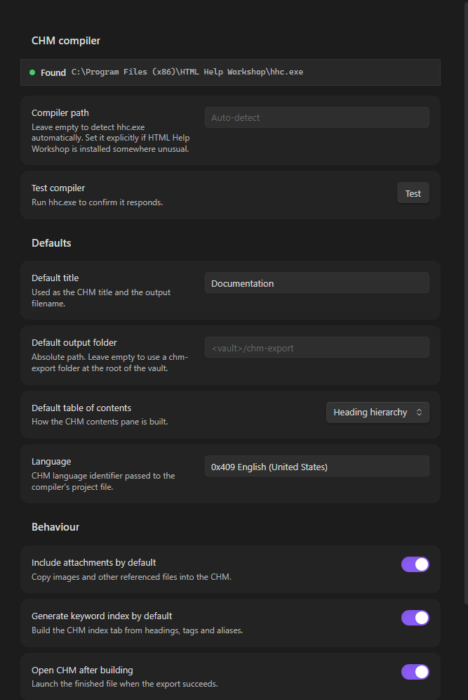
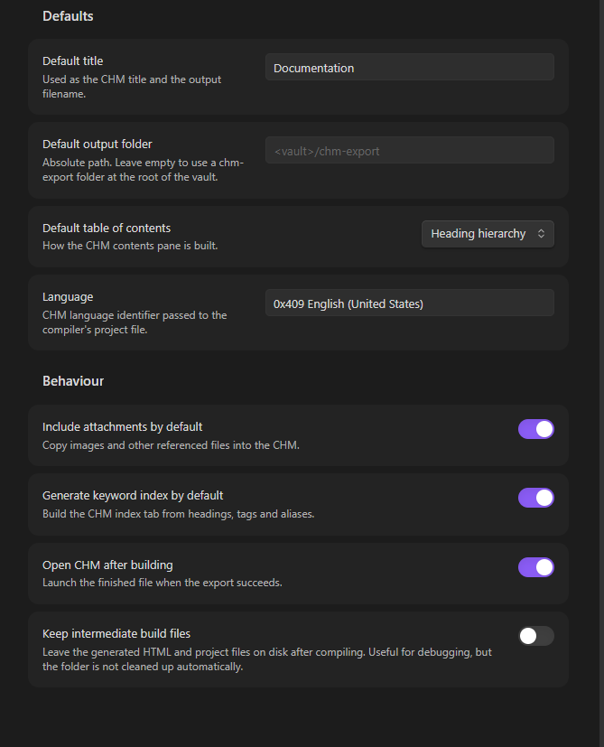

# Markdown to CHM

An Obsidian plugin that compiles one or many notes — with their attachments —
into a single offline **Compiled HTML Help (`.chm`)** file.

CHM is a self-contained documentation format: one file, with a table of contents,
a keyword index and full-text search, that opens in Windows without a browser or
a server. That makes it a good fit for shipping user guides, API references and
internal runbooks.

## Screenshots

The settings tab detects the CHM compiler for you and holds the defaults used by
the export dialog:



The build behaviour toggles sit below, including the option to keep the
intermediate build files for debugging:



## Requirements

**Windows only**, and it needs **HTML Help Workshop** — Microsoft's CHM compiler
(`hhc.exe`). It is not bundled with the plugin.

> **Microsoft no longer distributes it.** The download page was retired and the
> installer pulled from Microsoft's servers — the link has returned 404 since
> 2021, and no replacement has been published. The plugin cannot ship the
> installer itself, because Microsoft's licence does not permit redistributing it.

1. Download Microsoft's original installer (3.4 MB) from the Internet Archive's
   copy of it:
   <https://web.archive.org/web/20200918004813id_/https://download.microsoft.com/download/0/A/9/0A939EF6-E31C-430F-A3DF-DFAE7960D564/htmlhelp.exe>

   Check it before running it. The copy above is genuine if its MD5 is
   `53899be5da83419d772d5b97e653da7c` and its Authenticode signature is `Valid`,
   signed by *Microsoft Corporation*:

   ```
   Get-FileHash .\htmlhelp.exe -Algorithm MD5
   Get-AuthenticodeSignature .\htmlhelp.exe | Select Status, SignerCertificate
   ```

   If either check fails, delete the file — it is not Microsoft's installer.

   On Chocolatey, `choco install html-help-workshop` fetches the same archived
   installer and verifies its checksum for you.
2. Install it (the default location is fine).
3. In Obsidian, open **Settings → Markdown to CHM**. The compiler should be
   detected automatically and shown as **Found**.
4. If it is not detected, paste the path to `hhc.exe` into the **Compiler path**
   field. It is usually at:
   `C:\Program Files (x86)\HTML Help Workshop\hhc.exe`
5. Press **Test** to confirm the compiler responds.

## Usage

Open the export dialog from the ribbon icon, the command palette
(**Export to CHM…**), or **Export current note to CHM**.

1. **Source** — choose what to export:
   - *Current file* — the note you have open.
   - *Active folder* — every note in the open note's folder, including
     subfolders. Good for exporting a whole section of a vault.
   - *Choose notes* — pick individual notes from a searchable list.
2. **Details** — set the title and the output folder. The folder picker suggests
   locations inside your vault; any absolute path works.
3. **Options** — choose how the table of contents is built, and whether to
   include attachments and generate the keyword index.
4. Press **Export**. Progress and the compiler log appear in the dialog, and the
   finished `.chm` opens automatically.

### Table of contents

| Mode | Behaviour |
|---|---|
| **Heading hierarchy** | Nests H2–H6 from each note under its title. Produces a natural reading order, and works best when your notes use consistent heading levels. |
| **Folder structure** | Mirrors the vault's folder tree. Predictable, and matches how you organised the files. |
| **Single flat list** | An alphabetical list of every page. |

### Keyword index

The index tab is built from note headings plus **tags**. Both frontmatter tags
and inline `#tags` in the body are picked up, including nested tags such as
`#project/alpha`. Frontmatter aliases are also indexed, so notes stay findable by
their alternate names.

## Features

- Uses Obsidian's own renderer, so wikilinks, embeds, callouts, math and syntax
  highlighting all come through.
- Internal links are rewritten to point at the exported pages. Links to notes
  that are not part of the export are flattened to plain text so the CHM has no
  dead ends.
- Images and other referenced files are copied in and embedded, not linked.
- The generated stylesheet is written for the CHM viewer's old rendering engine,
  so pages look consistent rather than relying on modern CSS it ignores.

## Limitations

- **Windows only.** The plugin is marked desktop-only and needs `hhc.exe`.
- **Math** renders as static markup. The CHM viewer cannot run MathJax, so
  complex expressions may look plainer than they do in Obsidian.
- **CSS is constrained.** The CHM viewer uses an IE-era engine: no flexbox, no
  grid, no CSS variables. The bundled stylesheet avoids all of these.
- **JavaScript does not run** inside a CHM. Interactive elements and Dataview
  query results will not be live — export a note that contains the rendered
  output if you need it.
- Canvas files and Excalidraw drawings are exported only as far as they render
  to images in a note.

## How it works

`hhc.exe` is unusually picky about paths: it fails on paths containing spaces and
cannot handle any folder whose name begins with a dot — which every Obsidian
vault has (`.obsidian`). It can also exit successfully after a failed build.

So the plugin never compiles in place. It renders the notes to HTML, stages
everything in a short, space-free temporary directory under a resolved 8.3 path,
compiles there and copies the finished `.chm` to your chosen folder. Success is
decided by checking that a non-empty `.chm` was actually produced and that no
`HHC####: Error` codes were reported — not by the exit code.

Enable **Keep build files** in the options (or in settings) to inspect the
generated HTML and project files. Nothing is cleaned up automatically in that
mode.

## Development

```bash
npm install
npm run dev     # watch build
npm run build   # type-check + production bundle
npm test        # smoke tests for path handling and project-file generation
```

To try it in a vault, copy `main.js`, `manifest.json` and `styles.css` into
`<vault>/.obsidian/plugins/md-to-chm/` and enable the plugin in
**Settings → Community plugins**.

## License

MIT © 2026 Kerekes Stefan
